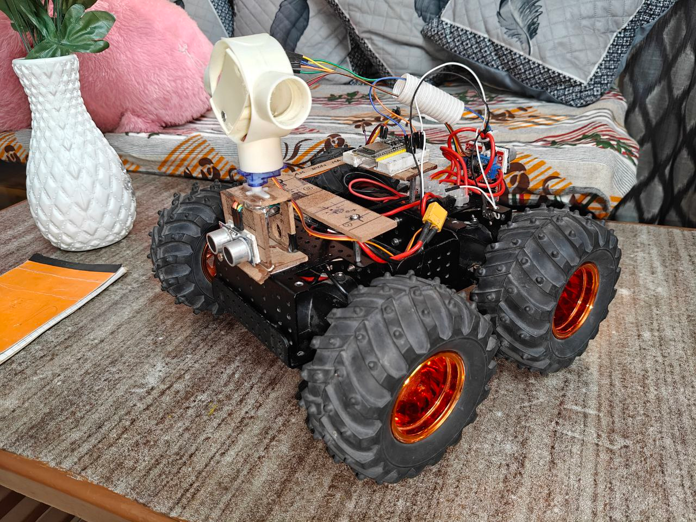

# S.C.O.U.T. - Surveillance-Controlled Unmanned Tracker





> A low-cost autonomous robotic vehicle designed for surveillance, obstacle detection, and autonomous navigation - built from scratch without ROS, evolving towards full autonomy.

## 🎯 Project Overview

**S.C.O.U.T.** (Surveillance-Controlled Unmanned Tracker) is an open-source autonomous vehicle system that started as a remote-controlled robot and is evolving into a fully autonomous delivery prototype. The project emphasizes low-cost components, modular design, and step-by-step capability building.

### Key Features
- 🕹️ **Dual Control Modes**: Web-based UI and Manual RC control
- 📹 **Real-time Video Streaming** via ESP32-CAM
- 🚧 **Obstacle Detection** using ultrasonic sensors
- 📊 **Sensor Monitoring Dashboard** with real-time data
- 🧠 **IMU Integration** for orientation and acceleration tracking
- 🎮 **Intuitive Control Interface** with RC-style layout
- 🔄 **Seamless Mode Switching** between manual and web control

## 🛠️ Build Journey: From Concept to Reality

### Phase 1: Planning & Design
The project began with a clear vision: create a robust, tank-like robotic platform that could serve as the foundation for advanced autonomous capabilities. The name "SCOUT" perfectly captures its mission - a mobile system designed to scout environments and perform surveillance missions.

### Phase 2: Hardware Selection & Assembly

#### Core Components
| Component | Purpose | Specifications |
|-----------|---------|----------------|
| **ESP32** | Main microcontroller | Web server, sensor processing, motor control |
| **ESP32-CAM** | Vision system | Real-time video streaming over Wi-Fi |
| **HC-SR04 Ultrasonic Sensors** | Obstacle detection | Front, left, and right positioning |
| **MPU6050** | Inertial measurement | 6-axis gyroscope and accelerometer |
| **L298N Motor Driver** | Motor control | Dual H-bridge for differential drive |
| **DC Motors** | Locomotion | Geared motors for tank treads |
| **FS-iA6B FlySky Receiver** | RC control | 6-channel receiver for manual override |
| **Tank Chassis** | Platform | Robust base with tread system |
| **Battery Pack** | Power system | 12V Li-ion configuration |

#### Assembly Process

**1. Chassis Preparation**
- Selected a tank-style chassis for maximum stability and terrain capability
- Mounted motor driver and ESP32 inside the chassis for protection


**2. Sensor Integration**
- **Front Ultrasonic**: Primary obstacle detection
- **Side Ultrasonics**: Lateral awareness for navigation
- **MPU6050**: Mounted for optimal orientation sensing
- **Raspi-CAM**: will be added

**3. Control Electronics**
- ESP32 configured as both web server and motor controller
- L298N motor driver wired for differential drive control
- FlySky receiver integrated for seamless manual override
- Power distribution system designed for stable operation

### Phase 3: Software Development

#### Control System Architecture
```
ESP32 (Main Controller)
├── Web Server (Control Interface)
├── Sensor Data Processing
├── Motor Control Logic
└── RC Signal Processing
```

#### Key Features Implemented:

**Web-Based Control Interface**
- Responsive 3x3 button grid layout
- Real-time sensor data display


**Sensor Monitoring System**
- Front/Back ultrasonic distance readings
- X/Y acceleration from MPU6050
- Calculated speed estimation

**Dual Control Architecture**
- **Channel 6 Mode Switching**: Seamless transition between RC and web control
- **Manual Override**: RC control takes precedence for safety
- **Fail-safe Operation**: Automatic stop on signal loss

## 🚀 Current Capabilities

### Control Modes

#### 1. Web-Based UI Control
- **Access**: Connect to ESP32's hosted Wi-Fi network
- **Interface**: Intuitive button layout (Forward, Back, Left, Right, Stop)
- **Monitoring**: Real-time sensor dashboard

#### 2. Manual RC Control
- **Transmitter**: FlySky FS-i6 compatible
- **Channels**: 
  - CH1: Steering control
  - CH2: Throttle control
  - CH6: Mode switching (RC/Web)
- **Override**: Manual control always takes priority


### Sensor Capabilities
- **Obstacle Detection**: will use camera 
- **Orientation Tracking**: Real-time tilt and acceleration monitoring
- **Speed Calculation**: will use wheel encoders and IMU data

## 🧠 Advanced Control Theory Integration

### Current Implementation: Basic Reactive Control
The current system uses simple reactive control based on sensor inputs:
- Obstacle avoidance using ultrasonic sensor thresholds
- Direct motor control based on user input or sensor triggers

### Planned Advanced Control Systems

#### PID Control Implementation
```python
# Planned PID controller for precise movement
class PIDController:
    def __init__(self, kp, ki, kd):
        self.kp = kp  # Proportional gain
        self.ki = ki  # Integral gain  
        self.kd = kd  # Derivative gain
        # Implementation for wheel speed control and path following
```

#### LQR Control for Optimal Performance
- **State Variables**: Position, velocity, orientation
- **Control Inputs**: Left/right motor speeds
- **Optimization**: Minimize tracking error and control effort

## 🎯 Roadmap to Full Autonomy (Future Scope)

### Phase 4: Advanced Navigation (In Progress)
- **Hardware Upgrade**: Raspberry Pi 4 (8GB) as main computing unit
- **Vision System**: ToF camera or smartphone integration
- **SLAM Implementation**: Simultaneous Localization and Mapping
- **Path Planning**: A* or RRT algorithms for route optimization

### Phase 5: Computer Vision Integration
- **Object Recognition**: Identify obstacles, targets, and landmarks
- **Lane Detection**: For structured environment navigation
- **Visual Odometry**: Camera-based position estimation
- **Sensor Fusion**: Combine visual and IMU data

### Phase 6: Autonomous Delivery Prototype
- **Point-to-Point Navigation**: GPS and vision-based waypoint following
- **Load Management**: Payload handling and delivery confirmation
- **Fleet Communication**: Multi-robot coordination capabilities

## 📝 License

This project is licensed under the MIT License - see the [LICENSE](LICENSE) file for details.

## 📞 Contact & Support

- **GitHub Issues**: For bug reports and feature requests
- **Email**: [pgnta.1385@gmail.com]
- **Documentation**: Comprehensive guides in the `/docs` folder

---

**SCOUT** represents more than just a robot - From basic remote control to advanced autonomous navigation, this project documents the complete journey of building a capable robotic system from scratch.

*"Every expert was once a beginner. Every pro was once an amateur."* - This project embodies that philosophy, showing that with persistence and proper documentation, anyone can build sophisticated robotic systems.
